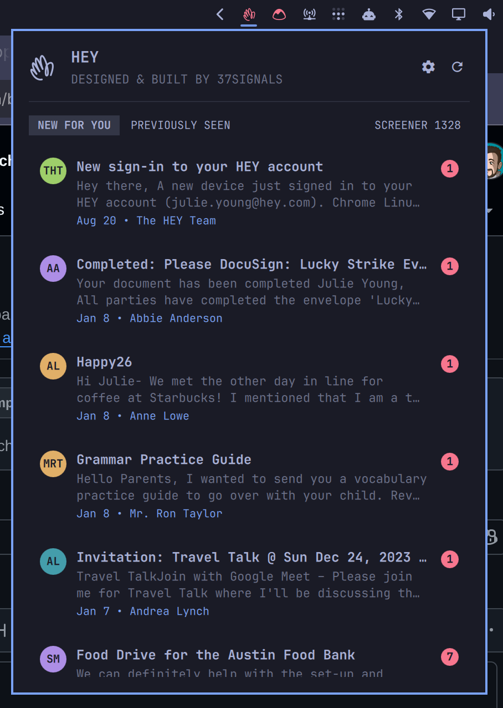

# HEY email for Omarchy

A Quickshell bar plugin that shows unread and recent email from your HEY Imbox through the [HEY CLI](https://github.com/basecamp/hey-cli).



## Features

- Shows unseen Imbox email from every linked HEY account.
- Switches between accounts with a dropdown that shows the unread count per account.
- Splits email into `New for you` and `Previously seen` tabs.
- Shows the pending Screener count without including it in the unread count.
- Updates live: the panel and the logo follow your Imbox as it changes, over HEY's own change feed — a thread you archive in `hey tui`, on your phone or in the web app leaves the panel within a second.
- Toasts new mail when you turn notifications on — one notification per batch of changes at most, replaced rather than stacked, silenced by Omarchy's notification toggle.
- Provides panel settings for the app that opens email and notification state.
- Shows sender initials in a colored avatar on each email row.
- Opens email topics in HEY and marks unseen postings as seen.
- Changes the bar logo color when unseen email exists.
- Rechecks the Imbox and Screener every 10 minutes as a fallback for the live connection. Right-click or middle-click the bar logo to refresh immediately.

## Requirements

- Omarchy with Quickshell plugin support.
- [HEY CLI](https://github.com/basecamp/hey-cli) 0.2.2 or newer.
- A HEY account.

## Installation

Install the CLI from the AUR, enable the plugin, complete HEY's guided setup, and add the CLI's Omarchy desktop integration:

```bash
omarchy pkg aur add hey-cli
omarchy plugin add https://github.com/basecamp/omarchy-hey-plugin.git --enable
hey
hey setup omarchy
```

The first `hey` run signs in through the browser and shows the accounts linked to your HEY identity. `hey setup omarchy` adds the HEY Terminal UI launcher, SUPER+SPACE menu entry, and theme template. Use `hey setup omarchy --notify` instead to turn on new-mail notifications during desktop setup; they remain off by default and can also be enabled from the panel settings.

When the HEY CLI is missing or signed out, the panel shows a setup button that installs the AUR package or opens HEY sign-in in a floating terminal. The panel detects completion automatically. You can also copy the displayed command and run it yourself.

Confirm that the CLI can see your Imbox:

```bash
hey box imbox
```

The plugin uses the CLI's existing credential store. Credentials stay managed by the HEY CLI; the plugin never reads a token.

For a local checkout, pass its path instead:

```bash
omarchy plugin add ~/code/basecamp/omarchy-hey-plugin --enable
```

The plugin manifest declares the right bar section as its default placement.

## Updating

Update the plugin checkout through Omarchy:

```bash
omarchy plugin update 37signals.hey --yes
```

HEY CLI updates arrive through the normal Omarchy and AUR package update process. The panel reports when the installed CLI is older than its minimum supported version.

## Removal

Remove the desktop integration and plugin with:

```bash
hey setup omarchy --remove
omarchy plugin remove 37signals.hey --yes
```

Plugin removal unloads HEY and removes its checkout. The HEY CLI package, its credential store, and the saved plugin settings in `~/.config/omarchy/shell.json` are separate and remain available for a future installation. Clear the stored HEY credentials with `hey auth logout`; if the CLI is no longer used elsewhere, remove its package separately through Omarchy's package manager.

## Usage

- Left-click the HEY logo to open or close the panel.
- Right-click or middle-click the logo to refresh.
- Select `New for you` or `Previously seen` below the account dropdown.
- Pick an account from the dropdown when more than one account is linked. A dot on the dropdown shows unread email in other accounts.
- Click an email to open it in HEY and mark it as seen. Click the count badge to mark it as seen without opening it.
- Click the cog to flip the panel to its settings. The back arrow returns to email.
- Use the up and down arrow keys to move through email. Use the left and right arrow keys to cycle accounts.
- Press `U` for new email, `P` for previously seen email, `S` for the Screener, `N` to toggle notifications, or `R` to refresh.

## Demo data

Launch the current checkout with fictional accounts and email:

```bash
./demo/run
```

The demo uses an empty workspace and temporarily shows only the HEY widget on the right side of the bar. Press `Ctrl+C` to restore the normal shell, plugin installation, bar layout, and previous workspace.

Create a clean screenshot cropped to the top bar and open panel with:

```bash
./demo/run --screenshot
```

The screenshot is saved in `~/Pictures`. Choose a destination explicitly when useful:

```bash
./demo/run --screenshot --output /tmp/hey-demo.png
```

Demo mode runs the plugin against `demo/bin/hey`, which implements the same CLI commands used in production. It never reads HEY credentials or contacts HEY. Mark-as-seen actions are kept in temporary session state and disappear when the demo exits.

## Live updates

The plugin is an Omarchy service as well as a bar widget: the shell starts it once, and every bar — one per monitor — reads that one instance, so one `hey watch` runs per shell. `hey --account all watch --events added,updated,deleted,new,resync` follows every HEY box of every linked account over HEY's cable — a persisted default account selection cannot hide changes from the panel — and prints a line per change. Each well-formed, bounded event wakes an Imbox read, debounced so a burst costs one read plus one follow-up when changes land while a read is in flight. Malformed events are discarded, and an event-rate budget pauses an abusive watch for one minute while a full read reconciles the panel. The watch says `ready` once it is listening, and again after it catches up from a disconnect — a suspended laptop, a dropped network — and the read on that line is what keeps the panel gap-free and current within seconds of coming back. A fixed 10-minute refresh also rechecks the Imbox and Screener count, covering missed events and data that does not arrive through the box stream.

The bar logo's tooltip says `live` while the watch has said `ready` and not `disconnected` since. When the watch stops for a reason other than being signed out, the panel header says so and the plugin restarts it on a backoff (two seconds, doubling to a minute); signed out, it waits for you to sign in again.

## Notifications

Off by default. The Notifications setting turns new-mail toasts on; so do `hey setup omarchy --notify` and `omarchy bar set 37signals.hey notify true --json`. Each option updates the `notify` key on the plugin's entry in `~/.config/omarchy/shell.json`, which the shell hot-reloads. Flipping it only gates the toasts; the watch runs on, and nothing restarts.

The **Open emails in** setting chooses one destination for panel emails and new-mail notifications. **HEY Terminal UI** is the default, **HEY App** opens a dedicated Omarchy web-app window, and **Browser** opens HEY in the normal browser. A single notification opens its thread, while a grouped notification opens the Imbox because it represents multiple threads.

Every `added` and `updated` line `hey watch` writes says whether the thread is new mail — unseen, unmuted, and active since the watch last saw it, or since the watch began for a thread it has not seen, so a box's backlog is never new and neither is reading, muting or moving a thread, while a reply on a known thread is. That is the CLI's call, made once on HEY's own clock. The plugin reads those lines for the Imbox — the watch follows every box, but only Imbox mail asks for attention — and sends the toast itself through `omarchy-notification-send`:

- At most one toast appears per burst of changes. One new thread shows `HEY`, its subject, and a truncated first content line. A group shows `HEY`, `N new in Imbox`, and the first few senders. A burst that lands while the previous toast is still on screen replaces it rather than stacking (the daemon's printed id is passed back as `-r`; it is trusted for ten minutes at most, since ids are daemon-local); once a toast has expired, the next burst is a fresh one — a replaced id the daemon no longer tracks is a new notification by the freedesktop rules.
- The toast identifies as HEY and displays its app icon, so SUPER+CTRL+comma (Omarchy's notification silencing) mutes it like any other app. Clicking it opens the destination selected in the panel settings.
- One watch per shell means one toast per burst, however many monitors. Nothing is written to disk.

## Privacy and security

The plugin runs these local CLI commands:

```text
hey --version
hey auth status --json
hey account list --json
hey accounts list --json  # HEY CLI 0.2.2 compatibility
hey box imbox --account all --limit <count> --json
hey --account all watch --events added,updated,deleted,new,resync
hey screener list --count --json
hey seen <posting-id> [--account <id>] --json
hey [--account <id>] tui --instance omarchy --topic <topic-id> [--remote]
flock -n <private runtime directory descriptor>
omarchy-notification-send --app-name HEY -u low --exec <configured HEY terminal, app, or browser command> <headline> [description] -i hey -p [-r <id>]
```

Finite CLI and notification-helper requests have bounded output and a 30-second deadline followed by process-group termination; the intentional long-lived `hey watch` is output- and event-rate-bounded and runs under `setpriv --pdeathsig TERM`, so it ends with the shell that started it.

Email data is held in Quickshell memory. Notification subjects and excerpts are passed as arguments to the local `omarchy-notification-send` helper and delivered to the local notification daemon; a selected subject can also be passed as a topic title to the local HEY Terminal UI process. Those arguments may be visible briefly to other processes running as the same user. The plugin does not write email content, credentials, or tokens to disk, and never handles a token at all; the watch keeps no state file either.

## License

MIT. Third-party attributions are listed in [THIRD_PARTY_NOTICES.md](THIRD_PARTY_NOTICES.md).
